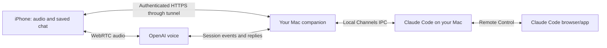

# Sidewalk

**Talk to Claude Code on your Mac, from your iPhone.**

Sidewalk is an open-source, self-hosted voice companion. Start a conversation, ask Claude to work, hear its answer, and continue later from the saved chat. A voice host handles conversation and conveys Claude's progress and answers; Claude Code does the work on your Mac.

This is an early source release for people comfortable with Terminal and Xcode. Bring your own Claude account, OpenAI API key, Mac and iPhone. There is no hosted Sidewalk account, prebuilt Mac installer or public TestFlight build yet. Provider usage is billed by the respective providers.

## What it does

- Natural voice requests without a confirmation keyword.
- Speak while the assistant responds to interrupt playback.
- One-tap new Claude threads and full saved conversation history.
- Quiet waiting sounds and progress updates grounded in the work's status.
- On-screen permission requests, with explicit approve/deny controls.
- Cellular and different-Wi-Fi connections through an outbound Mac tunnel.
- Claude-created sessions visible in Claude's Code section through Remote Control.

## What you need

- A Mac, Xcode 26+, an iPhone on iOS 26+, and your own Apple development signing for installation.
- Node 22.13+, npm, XcodeGen, cloudflared, and a current Claude Code installation.
- An individual Claude Pro/Max account for the guided setup. Organization accounts need additional policy/setup work; see [Team accounts](docs/team-accounts.md).
- An OpenAI API project with access to the models used here: `gpt-live-1` for voice, `gpt-5.6-luna` for intent routing, and `gpt-4o-mini-tts` for explicit replay outside a call. Subscription access to ChatGPT is not an API key. Availability and billing depend on your API account.

## Start on your Mac

Install [Claude Code](https://code.claude.com/docs/en/setup), Node and Xcode first. With [Homebrew](https://brew.sh) installed:

```sh
brew install cloudflared xcodegen
mkdir -p ~/Developer
cd ~/Developer
git clone https://github.com/luketas/sidewalk.git
cd sidewalk
npm ci
npm run build
npm run configure-key
npm run doctor
npm run personal -- login
npm run personal -- remote
```

`configure-key` accepts your key without displaying it and stores it privately on this Mac. The Claude login uses an isolated profile, keeping your existing login separate. Choose your individual Pro/Max account in the browser.

Keep that terminal running. Wait for **Internet connection:** in its output. In a second terminal, from the same repository:

```sh
npm run pair
```

This opens a fresh QR on the Mac. Install the iPhone app using the steps below, then scan it in Sidewalk → Settings → Scan Mac code (or Update connection). A setup code lasts five minutes; successful pairing lasts until revoked. Run `npm run pair` again if the setup code expires, without restarting the server.

The quickstart uses a temporary hostname that changes when the companion restarts. For daily use, follow [permanent connection and login startup](docs/mac-setup.md). With a stable hostname and the same saved data, rebooting does not require a new QR. Your Mac must be awake, online and logged in. A Claude thread may still need **Reconnect** after a process restart; unknown work is checked rather than blindly replayed.

## Install on your iPhone

```sh
xcodegen generate --spec apps/ios/project.yml
open apps/ios/Sidewalk.xcodeproj
```

In Xcode, select the Sidewalk app target → Signing & Capabilities, choose your Apple team, enable automatic signing and change the app bundle identifier to one unique to you. Select your connected iPhone and run. Accept Apple's Developer Mode/trust setup if prompted. Changes made only in the generated project are overwritten by XcodeGen; put permanent signing/bundle changes in `apps/ios/project.yml`.

Launch Sidewalk, scan the Mac QR, review the data-flow disclosure and tap Talk. Start with a disposable workspace. The personal helper creates one under `.local/accounts/personal/playground`. [Detailed Mac setup and troubleshooting](docs/mac-setup.md) cover workspace registration and native startup prompts.

## How it works



Claude is the source of substantive answers. The voice host handles turn-taking and can acknowledge a request, describe verified status and convey Claude's response. The Mac saves the conversation and full answers; the phone caches chat for later reading. Permitting a tool remains an explicit screen action.

## Privacy and limits

Self-hosted does not mean all processing stays on your Mac. Audio and selected context go to OpenAI; Claude receives your requests; Cloudflare terminates public HTTPS control traffic. Keys remain on the Mac, while the phone stores its pairing credential in device-only Keychain. Read [data flow, storage and deletion](docs/privacy.md).

This is one person's Mac/workspace, not a shared multi-user service. Do not share its pairing QR with other people. Claude Channels is a research preview, and this version uses the custom-channel development flag. Team integration has not passed a real organization-account test. Permissions may still require native Mac setup, and cancelling active Claude work must be done in Claude. Mac sleep, route changes and interruption quality need testing on your own device.

## Development

```sh
npm run check
npm run eval:intent
```

These tests use fixtures and do not make paid model calls. The suite covers durable task routing, authentication, account isolation, channel IPC, permissions, history and pairing renewal. Physical audio quality and model behavior need real device testing. See [contributing](CONTRIBUTING.md) and [security](SECURITY.md).

Licensed under [MIT](LICENSE). Third-party dependencies retain their own licenses; see [notices](THIRD_PARTY_NOTICES.md). Sidewalk is independent and is not an official Anthropic, OpenAI or Apple product.
